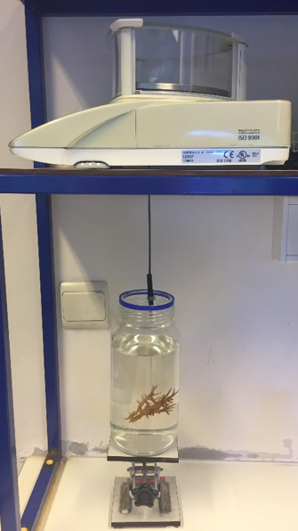

```{r setup, include=FALSE}
knitr::opts_chunk$set(echo = FALSE, warning = FALSE)
SciViews::R
pc <- read("../../data/physico.rds")
source(file = "../../R/function.R")
```

### Matériels et méthodes

\columnsbegin
\columnsmall
```{r,fig.align='center', echo=FALSE, out.width= '80%'}

```
\columnlarge

La \alert{masse squelettique} est déterminée via le \alert{poids immergé}

\columnsend

### Température

```{r, fig.align='c', out.width= '85%'}
pc %>.%
  filter(., !is.na(T)) %>.%
  pc_plot(data = ., y = "T", x = "number_day", factor = "code",
        rect_start = 29.83 + 0:5, rect_end = (29.83 + 0:5) + 0.5)
```
